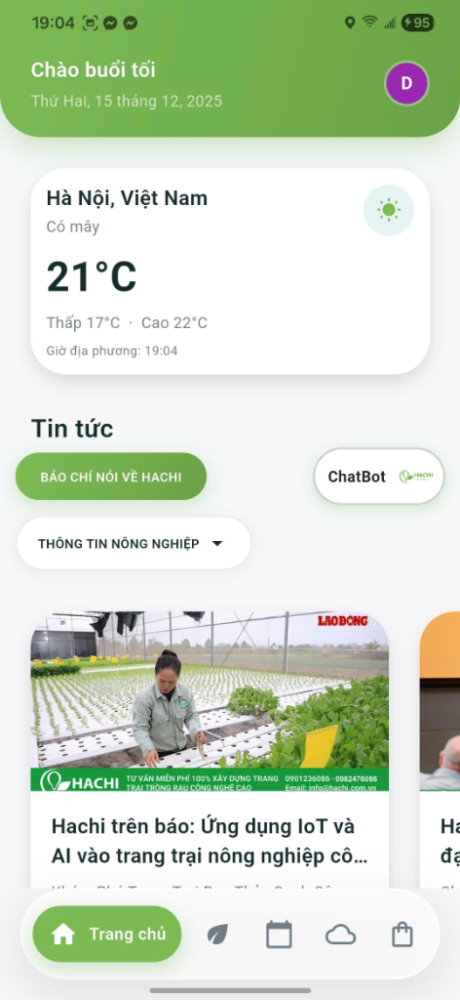
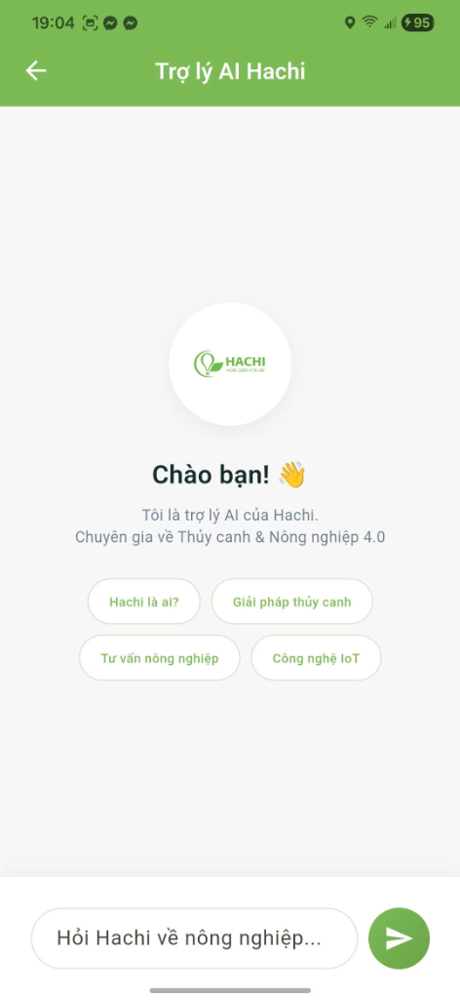
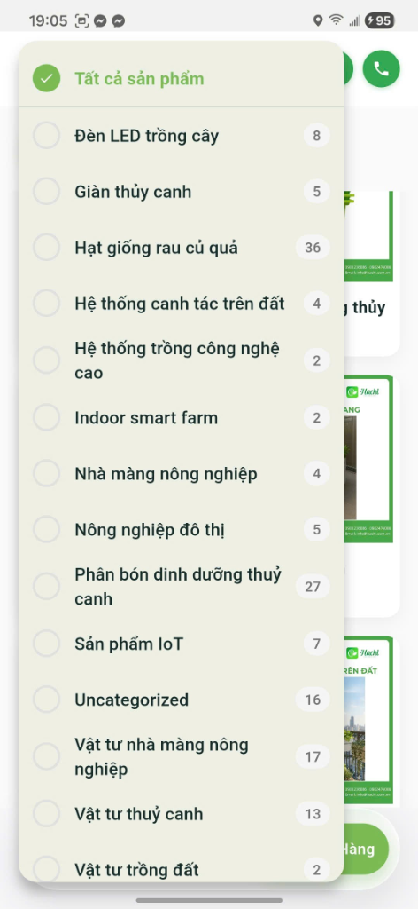
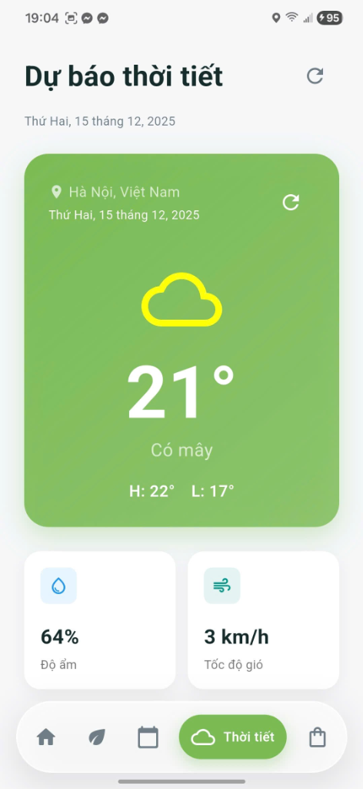
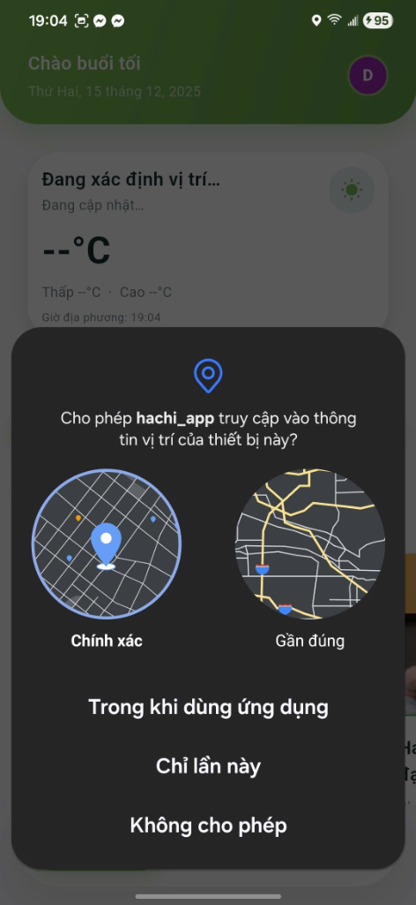

# Hachi App 🌿 - Ứng Dụng Nông Nghiệp Thông Minh

Hachi App là giải pháp công nghệ toàn diện dành cho nông nghiệp phố và trang trại công nghệ cao. Ứng dụng tích hợp AI, IoT và cơ sở dữ liệu chuyên sâu để giúp bạn trồng trọt dễ dàng, hiệu quả và năng suất hơn.

## 🌟 Tính Năng Nổi Bật

### 1. Dashboard Trực Quan
Theo dõi các chỉ số quan trọng ngay tại màn hình chính: thời tiết thời gian thực tại vị trí của bạn, tin tức nông nghiệp mới nhất và truy cập nhanh các tiện ích.



### 2. Trợ Lý AI Hachi (Smart Assistant)
Tích hợp trí tuệ nhân tạo chuyên sâu về nông nghiệp. Chat trực tiếp để hỏi về kỹ thuật trồng, xử lý sâu bệnh, hoặc lên kế hoạch mùa vụ. Hỗ trợ 24/7.



### 3. Thông Tin Chi Tiết & Bài Viết
Cập nhật kiến thức nông nghiệp, kỹ thuật canh tác VietGAP và các mô hình công nghệ cao thông qua kho dữ liệu phong phú.


### 4. Cửa Hàng Nông Nghiệp (Hachi Shop)
Hệ thống thương mại điện tử chuyên biệt: danh mục đa dạng (hạt giống, vật tư, dinh dưỡng), tìm kiếm thông minh và quy trình đặt hàng tiện lợi.

| Danh Mục | Sản Phẩm | Chi Tiết |
| :---: | :---: | :---: |
|  |  |  |


### 5. Thời Tiết Chuyên Sâu cho Nông Vụ
Dự báo chi tiết nhiệt độ, độ ẩm, lượng mưa để bạn chủ động trong việc gieo trồng và chăm sóc cây trồng.



### 6. Xác Thực & Bảo Mật
Hệ thống đăng nhập/đăng ký an toàn, bảo vệ dữ liệu người dùng và nhật ký canh tác cá nhân.

| Đăng Nhập | Xin Quyền Vị Trí |
| :---: | :---: |
|  |  |

---

## 🛠 Công Nghệ Sử Dụng

-   **Frontend**: Flutter (Dart) - Multi-platform (Android/iOS).
-   **Backend**: Supabase (PostgreSQL, Auth, Realtime).
-   **State Management**: Provider.
-   **AI Integration**: Google Gemini API (thông qua `google_generative_ai`).
-   **Key Packages**:
    -   `flutter_dotenv`: Quản lý biến môi trường an toàn.
    -   `geolocator` & `geocoding`: Định vị GPS.
    -   `webview_flutter`: Hiển thị nội dung HTML/Web.
    -   `provider`: Quản lý trạng thái ứng dụng.

---

## � Hướng Dẫn Cài Đặt

### 1. Yêu Cầu
-   Flutter SDK (Latest Stable)
-   Dart SDK
-   Tài khoản Supabase (cho Backend)
-   API Key Google Gemini (cho AI Chatbot)

### 2. Cài Đặt Dependencies
```bash
flutter pub get
```

### 3. Chạy Ứng Dụng
```bash
flutter run
```

---

## 📱 Cấu Trúc Thư Mục

```
lib/
├── models/         # Data Models (Plant, Weather, User...)
├── providers/      # State Management (AuthProvider...)
├── screens/        # UI Screens
│   ├── auth/       # Login/Register
│   ├── dashboard/  # Home Screen & Widgets
│   ├── chat/       # AI Chatbot Interface
│   ├── shop/       # E-commerce features
│   └── weather/    # Weather Forecast
├── services/       # API Services (Supabase, Location, AI...)
├── utils/          # Constants, Helper Functions
└── widgets/        # Reusable UI Components
```

---
© 2025 Hachi Vietnam. All rights reserved.
